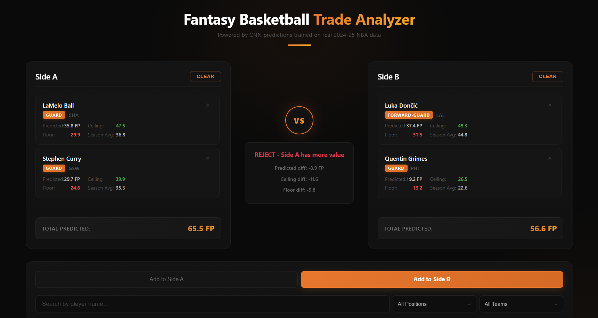

# Fantasy Basketball Trade Analyzer

A fantasy basketball trade analyzer powered by a hybrid CNN-LSTM model with multi-head attention, trained on real 2024-25 NBA game data. Compares players across predicted fantasy points, ceiling, and floor to help you evaluate trades.



## How It Works

1. **Real NBA Data** — Fetches 2024-25 season game logs for 150+ NBA players via the `nba_api` package
2. **Feature Engineering** — Builds 31 features per game including rolling averages, true shooting %, usage proxy, trend scores, and consistency metrics
3. **CNN-LSTM Model** — Uses 10-game sliding windows to predict next-game fantasy points, 90th percentile ceiling, and 10th percentile floor over the next 5 games
4. **Trade Analysis** — Compare sides of a trade across all three prediction outputs to get an ACCEPT, REJECT, or NEUTRAL recommendation

Fantasy scoring uses ESPN standard: `PTS + REB + AST + 2×STL + 2×BLK - TOV`

## Tech Stack

### Machine Learning
- **TensorFlow/Keras** — Hybrid CNN-LSTM with multi-head attention (~206K parameters)
- **nba_api** — Real NBA game log data
- **NumPy/Pandas** — Data processing and feature engineering

### Backend
- **FastAPI** — Predictions API and trade analysis endpoints
- **Python 3.8+**

### Frontend
- **React** — Trade analyzer UI with live player search
- **Vite** — Build tool and dev server
- **Axios** — HTTP client

## Model Performance

| Output Head | MAE | R² |
|---|---|---|
| Expected FP | 7.31 | 0.510 |
| Ceiling (90th pct) | 5.07 | 0.715 |
| Floor (10th pct) | 4.33 | 0.696 |

Train/validation split by player (not index) to prevent data leakage.

## API Endpoints

| Endpoint | Method | Description |
|---|---|---|
| `/api/predictions/players?q=&position=&team=` | GET | Search players |
| `/api/predictions/players/positions` | GET | List positions |
| `/api/predictions/players/teams` | GET | List teams |
| `/api/predictions/predict/{player_name}` | GET | CNN prediction for a player |
| `/api/predictions/trade` | POST | Trade analysis (body: `{side_a: [...], side_b: [...]}`) |

## Quick Start

**Terminal 1 — Backend:**
```bash
cd backend
source venv/bin/activate  # or venv\Scripts\activate on Windows
pip install -r requirements.txt
uvicorn app.main:app --reload --port 8000
```

**Terminal 2 — Frontend:**
```bash
cd frontend
npm install
npm run dev
```

Open http://localhost:3000

## Project Structure

```
trade-analyzer/
├── backend/
│   ├── FantastyBasketballProj/
│   │   ├── fantasy_cnn.py       # Model architecture and feature engine
│   │   ├── fetch_data.py        # NBA data pipeline
│   │   ├── train_model.py       # Training script
│   │   ├── predict_player.py    # CLI predictions
│   │   ├── data/                # Player game logs CSV
│   │   └── models/              # Trained model (.keras)
│   ├── app/
│   │   ├── main.py              # FastAPI entry point
│   │   ├── database.py          # MongoDB connection (optional)
│   │   └── routers/
│   │       └── predictions.py   # Predictions API
│   └── requirements.txt
├── frontend/
│   ├── src/
│   │   ├── pages/
│   │   │   ├── TradeAnalyzer.jsx  # Trade analyzer UI
│   │   │   └── TradeAnalyzer.css
│   │   └── services/
│   │       └── predictionService.js  # API client
│   └── package.json
└── README.md
```

## Why CNN-LSTM?

Fantasy basketball performance isn't random — it has both short-term patterns (hot/cold streaks, back-to-backs) and longer-term trends (role changes, minutes fluctuations). A CNN captures local patterns within recent games while an LSTM tracks how a player's production evolves over a sequence. Multi-head attention lets the model weigh which past games matter most for the current prediction, rather than treating all 10 games in the window equally. This hybrid approach outperforms a simple season-average baseline, particularly for ceiling and floor predictions where recent form matters more than historical averages.

## Future Improvements

- **Multi-season training data** — Expand beyond 2024-25 to improve model generalization and handle players with limited current-season data
- **Injury and rest-day awareness** — Incorporate injury reports and back-to-back schedule detection to adjust predictions for load management
- **Matchup-based adjustments** — Factor in opponent defensive ratings and pace to predict performance against specific teams
- **Live data updates** — Auto-fetch new game logs so predictions stay current throughout the season

## Contributors

**Pratham Subrahmanya** — CNN model architecture, real NBA data pipeline, feature engineering, model training, predictions API, trade analyzer UI, and frontend design
- GitHub: [@PrathamS29](https://github.com/PrathamS29) (personal) | [@PrathamS-23](https://github.com/PrathamS-23) (school)

**Shaun Gao** — Initial project scaffolding, authentication system, and MongoDB integration
- GitHub: [@shaungao123](https://github.com/shaungao123)

## License

MIT
